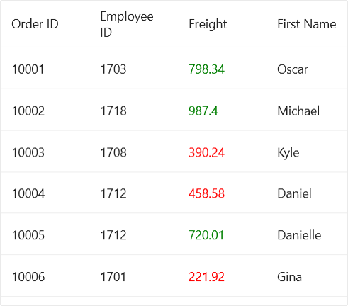

# How to Customize the TextColor for Cells in a Column based on the cell content from code behind.
In.NET [MAUI DataGrid](https://www.syncfusion.com/maui-controls/maui-datagrid) (SfDataGrid) allows you to customize the [Textcolor](https://help.syncfusion.com/cr/maui/Syncfusion.Maui.DataGrid.DataGridCell.html#Syncfusion_Maui_DataGrid_DataGridCell_TextColor) of the cells in a [DataGridColumn](https://help.syncfusion.com/cr/maui/Syncfusion.Maui.DataGrid.DataGridColumn.html) based on the [DataGridCell](https://help.syncfusion.com/cr/maui/Syncfusion.Maui.DataGrid.DataGridCell.html) content from code behind.

## XAML
```XML
<syncfusion:SfDataGrid x:Name="dataGrid" 
                      ItemsSource="{Binding OrdersInfo}"
                               AutoGenerateColumnsMode="None">
            <syncfusion:SfDataGrid.Columns>
                <syncfusion:DataGridTextColumn HeaderText="Order ID" MappingName="OrderID"/>
                <syncfusion:DataGridTextColumn HeaderText="Employee ID" MappingName="EmployeeID"/>
                <syncfusion:DataGridTextColumn HeaderText="Freight" MappingName="Freight"/>
                <syncfusion:DataGridTextColumn HeaderText="First Name" MappingName="FirstName"/>
                <syncfusion:DataGridTextColumn HeaderText="Last Name" MappingName="LastName"/>
                <syncfusion:DataGridTextColumn HeaderText="ShipCity" MappingName="ShipCity"/>
                <syncfusion:DataGridTextColumn HeaderText="Customer ID" MappingName="CustomerID"/>
            </syncfusion:SfDataGrid.Columns>
        </syncfusion:SfDataGrid>
```

## C#
Refer the below code example for writing a converter to customize the cell `TextColor` based on condition.
### Converter
```C#
public class StyleConverter : IValueConverter
{
    public object Convert(object value, Type targetType, object parameter, System.Globalization.CultureInfo culture)
    {
        double _value = (double)value;
        if (_value >= 500)
            return Colors.Green;
        return Colors.Red;
    }
    public object ConvertBack(object value, Type targetType, object parameter, System.Globalization.CultureInfo culture)
    {
        return value;
    }
}
```
## C#
You can achieve your requirement by setting Style to [DataGridColumn.CellStyle](https://help.syncfusion.com/cr/maui/Syncfusion.Maui.DataGrid.DataGridColumn.html#Syncfusion_Maui_DataGrid_DataGridColumn_CellStyle) as in the below code example

```C#
public partial class MainPage : ContentPage
{
	public MainPage()
	{
		InitializeComponent();
        Style style = new Style(typeof(DataGridCell));
        style.Setters.Add(new Setter() { Property = DataGridCell.TextColorProperty, Value = new Binding("Freight", BindingMode.TwoWay, new StyleConverter()) });
        dataGrid.Columns[2].CellStyle = style;
    }
}
```


## Conclusion
I hope you enjoyed learning about how to you to customize the Textcolor of the cells in a DataGridColumn based on the DataGridCell content from code behind in MAUI DataGrid (SfDataGrid).

You can refer to our [.NET MAUI DataGrid’s feature tour](https://www.syncfusion.com/maui-controls/maui-datagrid) page to know about its other groundbreaking feature representations. You can also explore our .NET MAUI DataGrid Documentation to understand how to present and manipulate data.
For current customers, you can check out our .NET MAUI components from the [License and Downloads](https://www.syncfusion.com/account/downloads) page. If you are new to Syncfusion, you can try our 30-day free trial to check out our .NET MAUI DataGrid and other .NET MAUI components.
If you have any queries or require clarifications, please let us know in comments below. You can also contact us through our [support forums](https://www.syncfusion.com/forums), [Direct-Trac](https://support.syncfusion.com/account/login?ReturnUrl=%2Faccount%2Fconnect%2Fauthorize%2Fcallback%3Fclient_id%3Dc54e52f3eb3cde0c3f20474f1bc179ed%26redirect_uri%3Dhttps%253A%252F%252Fsupport.syncfusion.com%252Fagent%252Flogincallback%26response_type%3Dcode%26scope%3Dopenid%2520profile%2520agent.api%2520integration.api%2520offline_access%2520kb.api%26state%3D8db41f98953a4d9ba40407b150ad4cf2%26code_challenge%3DvwHoT64z2h21eP_A9g7JWtr3vp3iPrvSjfh5hN5C7IE%26code_challenge_method%3DS256%26response_mode%3Dquery) or [feedback portal](https://www.syncfusion.com/feedback/maui?control=sfdatagrid). We are always happy to assist you!

